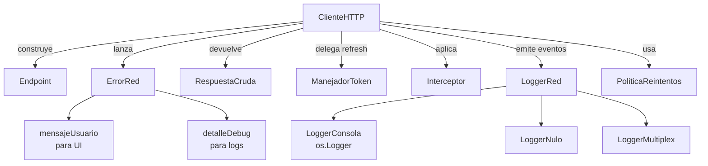

<div align="center">

# RedProfesional

**Cliente HTTP nativo para el ecosistema Apple.**  
Construido sobre `URLSession` y `async/await`. Sin dependencias externas.

[](https://swift.org)
[](https://developer.apple.com)
[](https://swift.org/package-manager)
[](LICENSE)

</div>

---

## ¿Por qué RedProfesional?

| | RedProfesional | URLSession directo | Alamofire |
|---|:---:|:---:|:---:|
| Zero dependencias | ✅ | ✅ | ❌ |
| async/await nativo | ✅ | ✅ | ✅ |
| Refresh token automático | ✅ | ❌ | ✅ |
| Interceptores | ✅ | ❌ | ✅ |
| Logging con `os.Logger` | ✅ | ❌ | ❌ |
| Cache HTTP (ETags/304) | ✅ | Manual | ✅ |
| Cancelación por ID | ✅ | Manual | ✅ |
| Solo ecosistema Apple | ✅ | ✅ | ❌ |

---

## Instalación

### Swift Package Manager

**Xcode:** File → Add Package Dependencies →

```
https://github.com/BurgerMike/RedProfesional.git
```

**Package.swift:**

```swift
dependencies: [
    .package(url: "https://github.com/BurgerMike/RedProfesional.git", from: "1.0.0")
],
targets: [
    .target(name: "MiApp", dependencies: ["RedProfesional"])
]
```

---

## Inicio rápido

```swift
import RedProfesional

// 1. Crea el cliente (una vez, en tu capa de servicios)
let cliente = ClienteHTTP(baseURL: URL(string: "https://api.ejemplo.com")!)
cliente.token = "mi-access-token"

// 2. Define un modelo
struct Producto: Decodable {
    let id: Int
    let nombre: String
    let precio: Double
}

// 3. Haz peticiones
let productos: [Producto] = try await cliente.request(
    endpoint: Endpoint(path: "productos"),
    tipo: [Producto].self
)
```

---

## Guía de uso

### Endpoints

`Endpoint` describe una petición: ruta, método HTTP, query params, headers y timeout.

```swift
// GET simple
Endpoint(path: "productos")

// Con query params  →  /productos?pagina=2&limite=20
Endpoint(path: "productos", query: ["pagina": "2", "limite": "20"])

// POST con body
Endpoint(path: "auth/login", metodo: .post)

// Timeout personalizado
Endpoint(path: "archivos/procesar", metodo: .post, timeout: 60)

// Header específico para este endpoint
Endpoint(path: "v2/reportes", headers: ["X-API-Version": "2"])

// Siempre va al servidor, ignora cache
Endpoint.sinCache(path: "cotizaciones")

// Solo usa cache, nunca red (modo offline)
Endpoint.soloCache(path: "configuracion")
```

---

### Peticiones

#### Con respuesta tipada

```swift
struct Perfil: Decodable {
    let id: Int
    let nombre: String
    let email: String
}

let perfil: Perfil = try await cliente.request(
    endpoint: Endpoint(path: "usuarios/perfil"),
    tipo: Perfil.self
)
```

#### Con body (POST / PUT / PATCH)

```swift
struct LoginBody: Encodable {
    let email: String
    let password: String
}

struct SesionRespuesta: Decodable {
    let accessToken: String
    let refreshToken: String
}

let sesion: SesionRespuesta = try await cliente.request(
    endpoint: Endpoint(path: "auth/login", metodo: .post),
    tipo: SesionRespuesta.self,
    body: LoginBody(email: "juan@ejemplo.com", password: "secreto")
)
```

#### Sin respuesta (204 / body vacío)

```swift
try await cliente.requestSinRespuesta(
    endpoint: Endpoint(path: "sesion", metodo: .delete)
)
```

#### Datos crudos (sin decodificar)

Útil para inspeccionar, almacenar en SwiftData o leer cabeceras.

```swift
let respuesta = try await cliente.requestCrudo(endpoint: Endpoint(path: "catalogo"))

print(respuesta.statusCode)           // 200
print(respuesta.esExitoso)            // true
print(respuesta.jsonPretty ?? "")     // JSON formateado
print(respuesta.bytes)                // tamaño en bytes
print(respuesta.header("ETag") ?? "") // cabecera específica

// Guardar en SwiftData
@Model class SnapshotCatalogo {
    var jsonData: Data
    var statusCode: Int
    var fecha: Date
}

let snapshot = SnapshotCatalogo()
snapshot.jsonData   = respuesta.data
snapshot.statusCode = respuesta.statusCode
snapshot.fecha      = respuesta.fecha
```

#### Solo JSON como String (para debug)

```swift
let json = try await cliente.requestJSON(endpoint: Endpoint(path: "usuarios/1"))
print(json)
// {
//   "id": 1,
//   "nombre": "Juan García"
// }
```

---

### Manejo de errores

Todos los errores son de tipo `ErrorRed` — tiene mensajes listos para mostrar al usuario y mensajes técnicos para logs.

```swift
do {
    let perfil: Perfil = try await cliente.request(
        endpoint: Endpoint(path: "usuarios/perfil"),
        tipo: Perfil.self
    )
} catch let error as ErrorRed {
    // Para mostrar en UI (Alert, banner, etc.)
    print(error.mensajeUsuario)
    // → "Sesión no válida. Inicia sesión de nuevo."

    // Para logs técnicos
    print(error.detalleDebug)
    // → "HTTP 401 body={"error":"token_expirado"}"

    // Manejo específico por caso
    switch error {
    case .red(tipo: .sinInternet, _):
        mostrarBannerOffline()

    case .red(tipo: .timeout, _):
        mostrarAlerta("La petición tardó demasiado")

    case .http(codigo: 401, _):
        navegarAlLogin()

    case .http(codigo: 403, _):
        mostrarAlerta("No tienes permiso para esto")

    case .http(codigo: let codigo, _) where (500...599).contains(codigo):
        mostrarAlerta("Error del servidor, intenta más tarde")

    case .decoding(let detalle):
        // El JSON no coincide con tu modelo — revisa el contrato de la API
        registrarEnCrashlytics(detalle ?? "")

    default:
        mostrarAlerta(error.mensajeUsuario)
    }
}
```

#### Tabla de errores

| Caso | Cuándo ocurre |
|---|---|
| `.red(tipo: .sinInternet)` | Sin conexión a internet |
| `.red(tipo: .timeout)` | La petición superó el tiempo límite |
| `.red(tipo: .cancelado)` | La petición fue cancelada |
| `.red(tipo: .dns)` | No se pudo resolver el host |
| `.red(tipo: .conexionPerdida)` | La conexión se interrumpió |
| `.red(tipo: .ssl)` | Fallo de seguridad TLS/SSL |
| `.red(tipo: .restringido)` | Datos móviles restringidos |
| `.http(codigo:body:)` | El servidor respondió fuera de 2xx |
| `.decoding(detalle:)` | El JSON no mapeó al tipo esperado |
| `.encoding(detalle:)` | El body no se pudo serializar |
| `.urlInvalida` | La URL construida es inválida |
| `.sinRespuestaHTTP` | La respuesta no es HTTP |
| `.desconocido(detalle:)` | Error no clasificado |

---

### Refresh token automático

Cuando el servidor responde `401`, el cliente renueva el token y reintenta la petición original — **sin que el usuario note nada**.

#### 1. Implementa el protocolo en tu app

```swift
// TokenManager.swift (en tu app, no en el package)
import RedProfesional

actor TokenManager: ManejadorToken {
    private var refreshToken: String
    private weak var cliente: ClienteHTTP?

    init(refreshToken: String, cliente: ClienteHTTP) {
        self.refreshToken = refreshToken
        self.cliente = cliente
    }

    func refrescarToken() async throws -> String {
        guard let cliente else { throw ErrorRed.desconocido(detalle: "Cliente no disponible") }

        struct Body: Encodable { let refreshToken: String }
        struct Respuesta: Decodable { let accessToken: String }

        let respuesta: Respuesta = try await cliente.request(
            endpoint: Endpoint(path: "auth/refresh", metodo: .post),
            tipo: Respuesta.self,
            body: Body(refreshToken: refreshToken)
        )
        return respuesta.accessToken
    }
}
```

#### 2. Conéctalo al cliente

```swift
let cliente = ClienteHTTP(baseURL: URL(string: "https://api.ejemplo.com")!)
cliente.token = accessToken
cliente.manejadorToken = TokenManager(refreshToken: refreshToken, cliente: cliente)

// A partir de aquí, si cualquier petición recibe un 401:
// 1. Se llama a TokenManager.refrescarToken()
// 2. Se actualiza cliente.token con el nuevo valor
// 3. Se reintenta la petición original automáticamente
```

> **Nota:** Si el refresh también falla (el refresh token expiró), se propaga `ErrorRed.http(codigo: 401)` y debes redirigir al login.

---

### Interceptores

Los interceptores ejecutan lógica transversal antes y después de cada petición. Útiles para headers globales, firmas, métricas o logging personalizado.

```swift
public protocol Interceptor: Sendable {
    func adaptarRequest(_ request: inout URLRequest) async throws  // antes de enviar
    func alRecibirRespuesta(_ respuesta: RespuestaCruda, de request: URLRequest) async  // en éxito
    func alFallar(_ error: ErrorRed, en request: URLRequest) async  // en fallo
}
// Las 3 funciones tienen implementación vacía por defecto — solo sobreescribe lo que necesitas
```

#### Ejemplo: Headers de versión de app

```swift
struct VersionInterceptor: Interceptor {
    func adaptarRequest(_ request: inout URLRequest) async throws {
        let version = Bundle.main.infoDictionary?["CFBundleShortVersionString"] as? String ?? "?"
        let build   = Bundle.main.infoDictionary?["CFBundleVersion"] as? String ?? "?"
        request.setValue("\(version) (\(build))", forHTTPHeaderField: "X-App-Version")
        request.setValue(UIDevice.current.systemVersion, forHTTPHeaderField: "X-OS-Version")
        request.setValue(UIDevice.current.model,         forHTTPHeaderField: "X-Device-Model")
    }
}
```

#### Ejemplo: Métricas de red

```swift
struct MetricasInterceptor: Interceptor {
    func alRecibirRespuesta(_ respuesta: RespuestaCruda, de request: URLRequest) async {
        Analytics.track(
            event: "api_success",
            properties: [
                "url":    request.url?.path ?? "",
                "status": respuesta.statusCode,
                "bytes":  respuesta.bytes
            ]
        )
    }

    func alFallar(_ error: ErrorRed, en request: URLRequest) async {
        Analytics.track(
            event: "api_error",
            properties: [
                "url":   request.url?.path ?? "",
                "error": error.detalleDebug
            ]
        )
    }
}
```

#### Registro de interceptores

```swift
cliente.interceptores = [
    VersionInterceptor(),
    MetricasInterceptor()
]
// Se aplican en orden: VersionInterceptor → MetricasInterceptor
```

---

### Cancelación de peticiones

Pasa un `requestId` propio para poder cancelar una petición específica más adelante.

```swift
// Al lanzar la petición
let requestId = UUID().uuidString

Task {
    do {
        let resultado = try await cliente.request(
            endpoint: Endpoint(path: "busqueda", query: ["q": textoBusqueda]),
            tipo: ResultadosBusqueda.self,
            requestId: requestId
        )
        mostrarResultados(resultado)
    } catch let error as ErrorRed where error == .red(tipo: .cancelado) {
        // cancelación silenciosa — no mostrar error al usuario
    }
}

// Al cancelar (p. ej. el usuario escribió más texto)
cliente.cancelar(requestId: requestId)

// Cancelar todas las peticiones activas (p. ej. al cerrar sesión)
cliente.cancelarTodo()
```

---

### Reintentos automáticos

El cliente reintenta ante fallos de red transitorios con **backoff exponencial + jitter** para evitar sobrecargar el servidor.

```swift
// Por defecto: 1 reintento, delay base 0.6 s con jitter ±25%
cliente.politicaReintentos = .default

// Personalizado
cliente.politicaReintentos = PoliticaReintentos(
    maxReintentos: 3,
    baseDelay: 1.0,      // 1s → ~2s → ~4s (con jitter)
    maxDelay: 30.0,      // nunca espera más de 30 s
    jitter: true
)

// También reintentar en 503 Service Unavailable y 429 Too Many Requests
cliente.politicaReintentos = PoliticaReintentos(
    maxReintentos: 3,
    codigosHTTPReintentables: [503, 429]
)

// Sin reintentos
cliente.politicaReintentos = .ninguno
```

Los errores que **sí** se reintentan por defecto: `.sinInternet`, `.timeout`, `.conexionPerdida`, `.dns`.  
Los errores que **nunca** se reintentan por defecto: HTTP 4xx/5xx, `.ssl`, `.cancelado`.

---

### Cache HTTP

`URLSession` y `URLCache` manejan la cache automáticamente respetando `Cache-Control`, `ETag` y `304 Not Modified` del servidor. Tú solo configuras el tamaño y la política por endpoint.

```swift
// Configurar tamaño de cache al iniciar la app
cliente.configurarCache(
    memoriaBytes: 50_000_000,   // 50 MB en RAM
    discoBytes:  200_000_000    // 200 MB en disco
)

// Política por endpoint
let endpointCatalogo  = Endpoint(path: "catalogo")                  // respeta el servidor
let endpointNoticias  = Endpoint.sinCache(path: "noticias")         // siempre va al servidor
let endpointConfig    = Endpoint.soloCache(path: "configuracion")   // solo cache (offline)

// Limpiar toda la cache
cliente.limpiarCache()
```

> La cache HTTP es complementaria a SwiftData: la cache HTTP evita descargas innecesarias en la sesión actual. SwiftData persiste datos entre sesiones. Usa ambas.

---

### Logging

`LoggerConsola` usa **`os.Logger`** del sistema — los eventos aparecen en **Console.app** e **Instruments** con soporte para filtros por subsistema y categoría.

```swift
// Desarrollo: ver todo
cliente.logger = LoggerConsola(nivelMinimo: .debug)

// Producción: solo errores
cliente.logger = LoggerConsola(nivelMinimo: .error)

// Subsistema y categoría propios (útil para filtrar en Console.app)
cliente.logger = LoggerConsola(
    nivelMinimo:  .info,
    subsistema:   "com.miempresa.miapp",
    categoria:    "RedProfesional"
)

// Sin logs
cliente.logger = LoggerNulo()

// Múltiples destinos
cliente.logger = LoggerMultiplex([
    LoggerConsola(nivelMinimo: .debug),
    MiLoggerCrashlytics()
])

// Logger propio
struct MiLoggerCrashlytics: LoggerRed {
    func log(_ evento: EventoLogRed) {
        guard evento.nivel >= .warning else { return }
        Crashlytics.log(evento.mensaje)
    }
}
```

**Ejemplo de salida en consola:**
```
[RedProfesional] ➡️ GET https://api.ejemplo.com/productos rid=A1B2C3
[RedProfesional] ✅ GET [200] rid=A1B2C3 bytes=2048
[RedProfesional] 🔄 Token expirado, refrescando... rid=D4E5F6
[RedProfesional] ✅ Token renovado, reintentando rid=D4E5F6
[RedProfesional] ❌ POST auth/login rid=G7H8I9 — HTTP 401
```

---

### Configuración avanzada

```swift
var cliente = ClienteHTTP(baseURL: URL(string: "https://api.ejemplo.com")!)

// Snake_case automático (user_name → userName)
cliente.jsonDecoder.keyDecodingStrategy = .convertFromSnakeCase

// Fechas ISO 8601
cliente.jsonDecoder.dateDecodingStrategy = .iso8601
cliente.jsonEncoder.dateEncodingStrategy = .iso8601

// Timeout global por defecto
cliente.timeoutPorDefecto = 30

// URLSession personalizada
let config = URLSessionConfiguration.default
config.requestCachePolicy = .reloadIgnoringLocalCacheData
config.waitsForConnectivity = true  // espera conexión si no hay red
let cliente = ClienteHTTP(
    baseURL: URL(string: "https://api.ejemplo.com")!,
    session: URLSession(configuration: config)
)
```

---

### Helpers de `Data`

Disponibles en toda tu app tras importar `RedProfesional`:

```swift
let data: Data = ...

data.jsonPretty  // String? — JSON formateado legible, nil si no es JSON válido
data.utf8String  // String? — texto plano UTF-8, nil si no es texto legible
```

---

## Integración completa — ejemplo real

Así se vería un `ServicioAPI.swift` típico usando todas las features juntas:

```swift
// ServicioAPI.swift
import RedProfesional

final class ServicioAPI {

    static let shared = ServicioAPI()

    let cliente: ClienteHTTP

    private init() {
        cliente = ClienteHTTP(baseURL: URL(string: "https://api.miapp.com")!)

        // Decoder: el backend usa snake_case
        var decoder = JSONDecoder()
        decoder.keyDecodingStrategy = .convertFromSnakeCase
        decoder.dateDecodingStrategy = .iso8601
        cliente.jsonDecoder = decoder

        // Logging: todo en desarrollo, solo errores en producción
        #if DEBUG
        cliente.logger = LoggerConsola(nivelMinimo: .debug)
        #else
        cliente.logger = LoggerConsola(nivelMinimo: .error)
        #endif

        // Interceptores globales
        cliente.interceptores = [
            VersionInterceptor(),   // añade X-App-Version a cada petición
            MetricasInterceptor()   // reporta éxitos y fallos a Analytics
        ]

        // Reintentos: 2 intentos extra en fallos de red, también en 503
        cliente.politicaReintentos = PoliticaReintentos(
            maxReintentos: 2,
            baseDelay: 0.8,
            codigosHTTPReintentables: [503]
        )

        // Cache: 30 MB en memoria, 150 MB en disco
        cliente.configurarCache(memoriaBytes: 30_000_000, discoBytes: 150_000_000)
    }

    // Llama esto tras un login exitoso
    func configurarSesion(accessToken: String, refreshToken: String) {
        cliente.token = accessToken
        cliente.manejadorToken = TokenManager(
            refreshToken: refreshToken,
            cliente: cliente
        )
    }

    // Llama esto al cerrar sesión
    func cerrarSesion() {
        cliente.token = nil
        cliente.manejadorToken = nil
        cliente.cancelarTodo()
        cliente.limpiarCache()
    }
}

// Uso desde cualquier ViewModel
struct ProductosViewModel {
    func cargarProductos() async throws -> [Producto] {
        try await ServicioAPI.shared.cliente.request(
            endpoint: Endpoint(path: "productos"),
            tipo: [Producto].self
        )
    }
}
```

---

## Datos de prueba sin servidor

Durante el desarrollo es habitual querer datos reales en pantalla sin backend disponible. La técnica es cargar un JSON local del bundle — sin red, sin `ClienteHTTP`.

```
JSON en bundle → Data(contentsOf:) → JSONDecoder → modelos Codable → View
```

### 1. Agrega el JSON al bundle

Arrastra el `.json` a tu target en Xcode y verifica **Build Phases → Copy Bundle Resources**.

### 2. Función de carga

```swift
func cargarJSON<T: Decodable>(_ nombre: String, tipo: T.Type) throws -> T {
    guard let url = Bundle.main.url(forResource: nombre, withExtension: "json") else {
        fatalError("\(nombre).json no está en el bundle")
    }
    return try JSONDecoder().decode(T.self, from: try Data(contentsOf: url))
}
```

### 3. ViewModel y Previews

```swift
@Observable final class EmpresasViewModel {
    var empresas: [Empresa] = []
    func cargar() {
        empresas = (try? cargarJSON("empresas", tipo: [Empresa].self)) ?? []
    }
}

#Preview {
    let vm = EmpresasViewModel()
    vm.cargar()
    return EmpresasListView(vm: vm)
}
```

### 4. Migración a producción — solo cambian dos líneas

```swift
// ANTES — bundle, síncrono
func cargar() {
    empresas = (try? cargarJSON("empresas", tipo: [Empresa].self)) ?? []
}

// DESPUÉS — RedProfesional, async
func cargar() async {
    empresas = (try? await ServicioAPI.shared.cliente.request(
        endpoint: Endpoint(path: "empresas"),
        tipo: [Empresa].self
    )) ?? []
}
```

> Los modelos `Codable`, el ViewModel y toda la UI quedan intactos al migrar.

---

## Arquitectura del package



| Archivo | Responsabilidad |
|---|---|
| `ClienteHTTP` | Punto de entrada. Orquesta todas las features. |
| `Endpoint` | Describe una petición: ruta, método, query, headers, cache. |
| `ErrorRed` | Errores tipados con mensajes para UI y para debug. |
| `RespuestaCruda` | Respuesta HTTP sin decodificar: body, status, headers, fecha. |
| `ManejadorToken` | Protocolo para refresh automático de token en 401. |
| `Interceptor` | Protocolo para lógica transversal: headers globales, métricas. |
| `LoggerRed` | Protocolo de logging + `LoggerConsola` / `LoggerNulo` / `LoggerMultiplex`. |
| `PoliticaReintentos` | Backoff exponencial con jitter para fallos transitorios. |

---

## Preguntas frecuentes

**¿Por qué no usar Alamofire?**
Alamofire es excelente pero trae dependencia externa, soporta Linux y tiene ~15k líneas de código. RedProfesional es exclusivo del ecosistema Apple, cero dependencias, y cabe entero en tu cabeza. Si ya usas Alamofire y estás contento, quédate con él. Si empiezas un proyecto nuevo solo para Apple, RedProfesional es suficiente para el 95% de los casos.

**¿Es thread-safe?**
Sí. `ClienteHTTP` es `final class` con todas sus propiedades mutables protegidas por `Locked<T>` (un wrapper sobre `NSLock`). Puedes leer y escribir `token`, `interceptores`, etc. desde cualquier hilo o `Task` sin riesgo de data race. Compatible con Swift 6 strict concurrency.

**¿Funciona con SwiftUI?**
Perfectamente. Úsalo desde cualquier `@Observable`, `ObservableObject`, o directamente en un `.task {}`. El cliente es `Sendable` así que no genera warnings de concurrencia en ningún contexto.

**¿Cómo persisto la respuesta entre sesiones?**
Usa `requestCrudo()` para obtener un `RespuestaCruda` y guarda `respuesta.data` en un `@Model` de SwiftData. RedProfesional no incluye persistencia adrede — eso es responsabilidad de tu app, no del cliente HTTP.

**¿El refresh token funciona si tengo varias peticiones simultáneas que reciben 401?**
Actualmente cada petición intenta su propio refresh de forma independiente. Si necesitas un único refresh compartido para peticiones concurrentes (token refresh serializado), implementa ese control en tu `ManejadorToken` usando un `actor` y una `Task` compartida.

**¿Puedo usar el package en macOS Catalyst o extensiones de app?**
Sí, ya que todo está construido sobre `Foundation` y `os.Logger`, que funcionan en cualquier target de Apple. Solo asegúrate de declarar la plataforma mínima correcta en tu target.

---

## Requisitos

| Plataforma | Versión mínima |
|---|---|
| iOS | 17.0 |
| macOS | 14.0 |
| tvOS | 17.0 |
| watchOS | 10.0 |
| visionOS | 1.0 |
| Swift | 6.0 |

---

## Licencia

MIT — ver [LICENSE](LICENSE) para más detalles.

****
